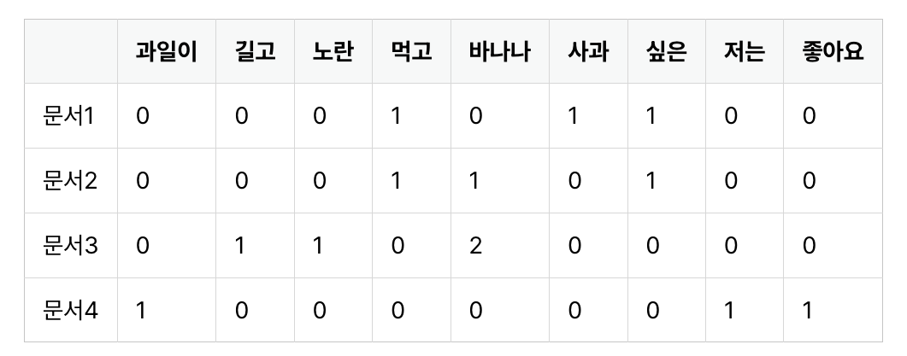
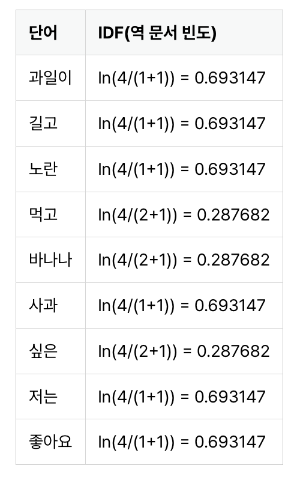
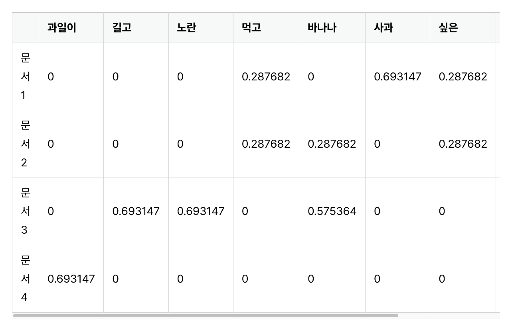

# Part 4.

# 04-04. TF-IDF

- Term Frequency-Inverse Document Frequency
- 단어 빈도-역 문서 빈도

## 1. TF-IDF

- 단어의 빈도와 역 문서 빈도를 사용해 DTM 내 각 단어에 가중치를 주는 방법

- 과정

1. DTM 구성
2. TF-IDF 가중치 부여

### 수식 정의

1. tf(d,t) : 특정 문서 d에서 특정 단어 t의 빈도 수
2. df(t) : 특정 단어 t가 등장한 문서의 수
3. idf(t) : df(t)에 반비례 하는 수

- 이때 기하급수적으로 증가하는 것을 방지하기 위해 자연로그(밑이 e)를 취한다.

### 예시

- 예시 문장
  문서1 : 먹고 싶은 사과
  문서2 : 먹고 싶은 바나나
  문서3 : 길고 노란 바나나 바나나
  문서4 : 저는 과일이 좋아요

1. TDM
   

2. IDF(역 문서 빈도) 구하기

- note. 프로그래밍 패키지에서 지원하는 TF-IDF는 대부분 자연로그 사용
  

3. TDM에 IDF 가중치 곱해주기
   

## 주의점

TF-IDF를 제공하는 머신 러닝 패키지에서 식은 비슷하지만, 조금씩 조정된 수식으로 제공한다.
 
기본 식을 바탕으로 구현하면 문제점이 존재하기 때문이다.

ex 1. 전체 문서 수 n = 4이고, df(t) = 3일때, IDF가 1이 된다.
