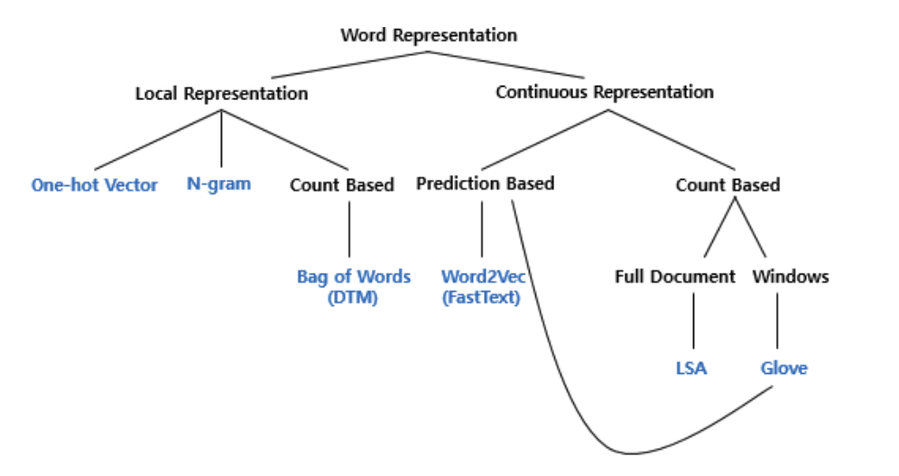

# Part 4. 카운트 기반의 단어 표현

자연어 처리에서 텍스트를 표현하는 방법은 여러가지 존재한다.
4장에서는 정보 검색과 텍스트 마이닝에서 자주 사용되는 DTM(Document Term Matrix)와 TFIDF(Term Frequency-Inverse Document Frequency)에 대해 다룬다.

위 방식들로 수치화를 하고 나면, 통계적 접근을 통해 여러 문서로 이루어진 텍스트 데이터가 존재할 때 어떤 단어가 특정 문서 내에서 중요한지를 나타낼 수 있다. 이외에 문서 내 핵심어 추출, 검색 엔진에서 검색 결과 순위 결정, 문서 간 유사도 등등에 사용된다.

# 04-1. 다양한 단어의 표현 방법

## 1. 단어 표현 방법

단어 표현 방법은 크게 국소 표현과 분산 표현으로 나뉜다.

국소 표현 방법은 해당 단어 자체만 보고 특정 값을 매핑해 표현한다.
 
분산 표현 방법은 그 단어를 표현하고자 주변을 참고해 단어를 표현하는 방법이다.

ex. puppy, cute, lovely
 

1. 국소 표현법

- puppy, cute, lovely에 각각 1, 2, 3번 부여

2. 분산 표현법

- puppy 단어 근처에 cute, lovely가 자주 등장하면, puppy를 cute, lovely한 단어라고 정의

국소 표현법은 단어의 의미를 나타낼 수 없으나, 분산 표현법은 나타낼 수 있다.

## 2. 단어 표현의 카테고리화

